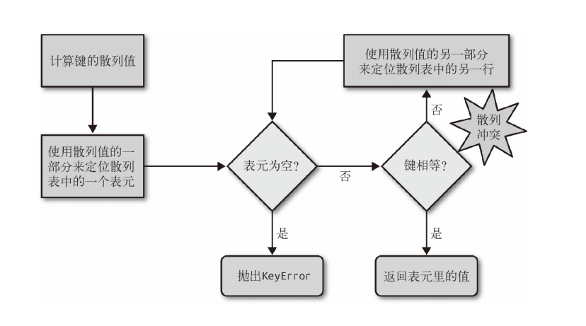

# 字典与集合

在讨论$$python$$中字典与集合背后的原理前，我们先了解下什么是`hashable `(可哈希化)。

## 可哈希化

在[python官方文档](https://docs.python.org/zh-cn/3/glossary.html#term-hashable)中,对`hashable`定义如下：

>一个对象的哈希值如果在其生命周期内绝不改变，就被称为 *可哈希* （它需要具有 [`__hash__()`](https://docs.python.org/zh-cn/3/reference/datamodel.html#object.__hash__) 方法），并可以同其他对象进行比较（它需要具有 [`__eq__()`](https://docs.python.org/zh-cn/3/reference/datamodel.html#object.__eq__) 方法）。可哈希对象必须具有相同的哈希值比较结果才会相同。

可哈希性使得对象能够作为字典键或集合成员使用，因为这些数据结构要在内部使用哈希值。

大多数 Python 中的不可变内置对象都是可哈希的；可变容器（例如列表或字典）都不可哈希；不可变容器（例如元组和 frozenset）仅当**它们的元素均为可哈希**时才是可哈希的。 用户定义类的实例对象默认是可哈希的。它们在比较时一定不相同（除非是与自己比较），它们的哈希值的生成是基于它们的 [`id()`](https://docs.python.org/zh-cn/3/library/functions.html#id)。来看下面的元组 `tt`、`tl` 和 `tf`： 

```python
>>> tt = (1, 2, (30, 40)) 

>>> hash(tt) 

8027212646858338501 

>>> tl = (1, 2, [30, 40]) 

>>> hash(tl) 

Traceback (most recent call last): 

File "<stdin>", line 1, in <module> 

TypeError: unhashable type: 'list' 

>>> tf = (1, 2, frozenset([30, 40])) 

>>> hash(tf) 

-4118419923444501110 
```

## 底层原理

python中的字典和集合的底层实现都是通过哈希表（散列表）。

散列表其实是一个稀疏数组（总是有空白元素的数组称为稀疏数组），在一般的数据结构教材中，散列表里的单元通常叫作表元（bucket）。在 dict 的散列表当中，每个键值对都占用一个表元，每个表元都有两个部分，一个是对键的引用，另一个是对值的引用。因为所有表元的大小一致，所以可以通过偏移量来读取某个表元。 因为 Python 会设法保证大概还有三分之一的表元是空的，所以在快要达到这个阈值的时候，Cpython会将原有的散列表**自动扩容**，复制到一个更大的空间里面。 如果要把一个对象放入散列表，那么首先要计算这个元素键的散列值。

### 散列值和相等性

python内置的 hash() 方法可以用于所有的内置类型对象。如果是自定义对象调用 hash() 的话，实际上运行的是自定义的 __hash__。如果两个对象在比较的时候是相等的，那它们的散列值必须相等，否则散列表就不能正常运行了。例如，如果 1 == 1.0 为真，那么 hash(1) == hash(1.0) 也必须为真，但其实这两个数字（整型 和浮点）的内部结构是完全不一样的。为了让散列值能够胜任散列表索引这一角色，它们必须在索引空间中尽量分散开来。这意味着在最理想的状况下，越是相似但不相等的对象，它们散列值的差别应该越大。

### 散列表算法 

为了获取 my_dict[search_key] 背后的值：

1. Python首先会调用hash(search_key) 来计算 search_key 的散列值，把这个值最低的几位数字当作偏移量，在散列表里查找表元（具体取几位，得看当前散列表的大小）。
2. 若找到的表元是空的，则抛出 KeyError 异常。若不是空的，则表元里会有一对 found_key:found_value。 
3. 这时候 Python 会检验 search_key == found_key 是否为真，如 果它们相等的话，就会返回 found_value。
4. 如果 search_key 和 found_key 不匹配的话，这种情况称为散列冲突（哈希碰撞）。发生这种情况是因为，散列表所做的其实是把随机的元素映射到只有几位的数字上，而散列表本身的索引又只依赖于这个数字的一部分。为了解决散列冲突，算法会在散列值中另外再取几位，然后用特殊的方法处理一下，把新得到的数字再当作索引来寻找表元。 若这次找到的表元是空的，则同样抛出 KeyError；若非空，或者键匹配，则返回这个值；或者又发现了散列冲突，则重复以上的步骤。

哈希查找时的逻辑图： 


添加新元素和更新现有键值的操作几乎跟上面一样。只不过对于前者，在发现空表元的时候会放入一个新元素；对于后者，在找到相对应的表元后，原表里的值对象会被替换成新值。另外在插入新值时，Python 可能会按照散列表的拥挤程度来决定是否要重新分配内存为它扩容。如果增加了散列表的大小，那散列值所占的位数和用作索引的位数都会随之增加，这样做的目的是为了减少发生散列冲突的概率。 这也从侧面说明，为何字典集合会是乱序。

### 解决哈希碰撞

假若输入数据长而经过哈希后的散列值短的话，可能存在**不同的**输入哈希后散列值相同的情况。因此在哈希表中常会出现**哈希冲突**这个现象。

解决哈希冲突的方法一般有：开放寻址法、链式地址法、建立公共溢出区和再哈希法。而开放寻址法又分为线性探测、再平方探测、伪随机探测等。

Python中字典在遇到哈希冲突时使用是**开放寻址法**。

## 参考

1. 《流畅的Python》第三章
2. [从CPython源码理解：Python字典如何解决哈希冲突？ - 知乎 (zhihu.com)](https://zhuanlan.zhihu.com/p/365804855)